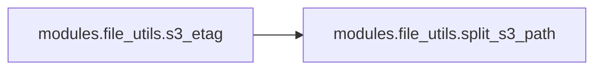
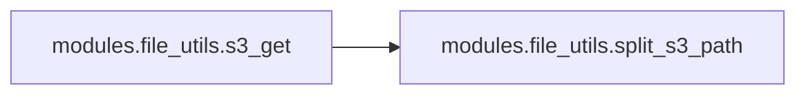

# Modules File Utils

[_Documentation generated by Documatic_](https://www.documatic.com)

<!---Documatic-section-Codebase Structure-start--->
## Codebase Structure

<!---Documatic-block-system_architecture-start--->
```mermaid
None
```
<!---Documatic-block-system_architecture-end--->

# #
<!---Documatic-section-Codebase Structure-end--->

<!---Documatic-section-modules.file_utils.s3_etag-start--->
## modules.file_utils.s3_etag

<!---Documatic-section-s3_etag-start--->


### Object Calls

* modules.file_utils.split_s3_path

<!---Documatic-block-modules.file_utils.s3_etag-start--->
<details>
	<summary><code>modules.file_utils.s3_etag</code> code snippet</summary>

```python
@s3_request
def s3_etag(url: str) -> Optional[str]:
    s3_resource = boto3.resource('s3')
    (bucket_name, s3_path) = split_s3_path(url)
    s3_object = s3_resource.Object(bucket_name, s3_path)
    return s3_object.e_tag
```
</details>
<!---Documatic-block-modules.file_utils.s3_etag-end--->
<!---Documatic-section-s3_etag-end--->

# #
<!---Documatic-section-modules.file_utils.s3_etag-end--->

<!---Documatic-section-modules.file_utils.s3_get-start--->
## modules.file_utils.s3_get

<!---Documatic-section-s3_get-start--->


### Object Calls

* modules.file_utils.split_s3_path

<!---Documatic-block-modules.file_utils.s3_get-start--->
<details>
	<summary><code>modules.file_utils.s3_get</code> code snippet</summary>

```python
@s3_request
def s3_get(url: str, temp_file: IO) -> None:
    s3_resource = boto3.resource('s3')
    (bucket_name, s3_path) = split_s3_path(url)
    s3_resource.Bucket(bucket_name).download_fileobj(s3_path, temp_file)
```
</details>
<!---Documatic-block-modules.file_utils.s3_get-end--->
<!---Documatic-section-s3_get-end--->

# #
<!---Documatic-section-modules.file_utils.s3_get-end--->

[_Documentation generated by Documatic_](https://www.documatic.com)